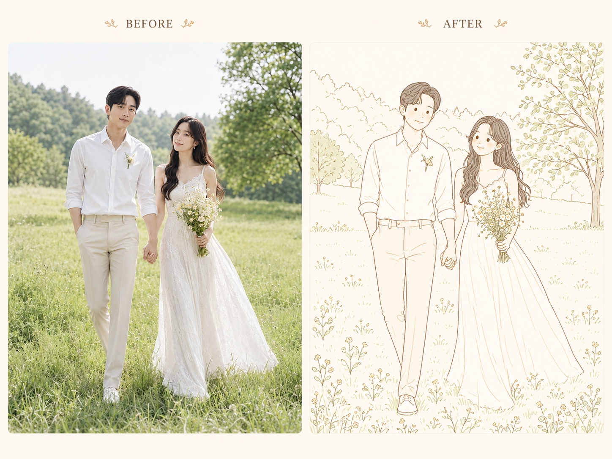
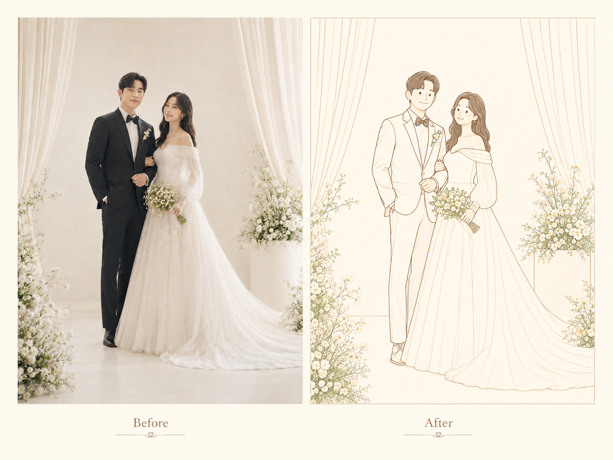

# 韩系暖棕极简婚礼插画 Skill

[简体中文](README.md) | [English](README.en.md)

这是一套面向婚纱照风格化重绘的中文 Skill，旨在将用户提供的婚礼照片转化为温柔、克制、轻盈的韩系婚礼纸品插画。它强调保留原照片的核心构图和人物关系，同时统一线条、减少细节，并通过大面积留白与少量低饱和色彩营造精致的暖棕色视觉风格。

## 效果预览

### 户外婚礼场景



### 室内婚礼场景



## 主要特点

- 忠实保留人物姿势、相对位置、身高关系与手部互动
- 保留发型、服装、背景和花卉的主要视觉特征
- 使用稳定、接近等线宽的暖棕色线条
- 将人物五官处理为简洁、成熟的符号化造型
- 大幅简化婚纱、西装、背景及花卉细节
- 以奶油白和暖象牙白为主，辅以少量低饱和色彩
- 强调人物周围及画面上方的留白与呼吸感
- 避免写实肖像、普通照片描边、动漫或 3D 渲染效果

## 适用场景

本 Skill 适合用于制作：

- 婚礼邀请函插画
- 婚礼迎宾牌插画
- 婚礼纪念卡片
- 婚礼社交媒体配图
- 韩系极简婚礼纸品视觉素材

## 文件说明

```text
wedding-warm-brown-korean-minimal-skill/
├── README.md                     # 中文项目介绍与使用说明
├── README.en.md                  # 英文项目介绍与使用说明
├── SKILL.md                      # 完整的风格规则、提示词、工作流程与质检标准
├── indoor-before-after.png       # 室内场景效果预览
└── outdoor-before-after.png      # 户外场景效果预览
